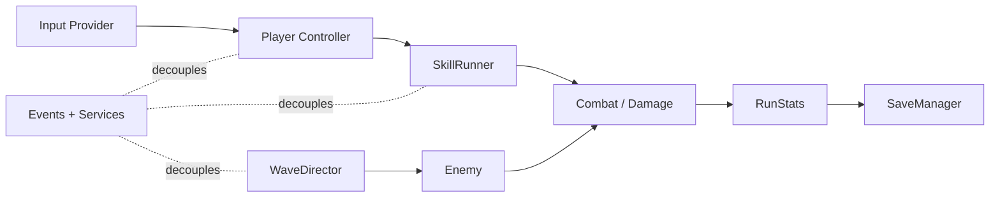

  
  
  

<h1 align="center">VSLikeGame — Gameplay Systems Package</h1>

A public, CV-friendly Unity package that demonstrates a maintainable gameplay architecture:
<strong>Player</strong>, <strong>Enemies</strong>, <strong>Skills</strong>, <strong>Progression</strong>, <strong>Save</strong>, <strong>Audio hooks</strong>, and a small <strong>run loop</strong>.

---

## Why this repo exists
- Shows **real, reusable systems** (not just small snippets)
- Organized as a **Unity UPM package** (clean, professional delivery)
- Clear boundaries + interfaces + events to keep features modular

## Modules (at a glance)
- **Gameplay Systems**: Data-driven enemy behaviors, projectile impact VFX hook, skill slots + UI hooks
- **Core**: Event bus, service registry, update runner
- **Run**: Run state, run timer, run stats (kills, time)
- **Combat**: Health, damage, hit events
- **Enemies**: Archetypes (SO), spawner, wave director, Charger + Ranged AI
- **Skills**: Skill interfaces, cooldowns, AoE + Projectile pipeline sample skills
- **Save**: JSON save with versioning + meta stats
- **Audio**: IAudioBus interface + lightweight AudioBus implementation + hooks
- **UI (sample)**: Minimal HUD hooks (time/kills)

## Architecture diagram

## Quick start (Unity)
**Option A — UPM (recommended):**
1. Unity: **Window → Package Manager → + → Add package from git URL**
2. Use: `https://github.com/<you>/VSLikeGame_CV_System_Repo.git?path=/Packages/com.vslikegame.systems`

**Option B — Copy:**
Copy `Packages/com.vslikegame.systems` into your project's `Packages/`.

---

### License
MIT
